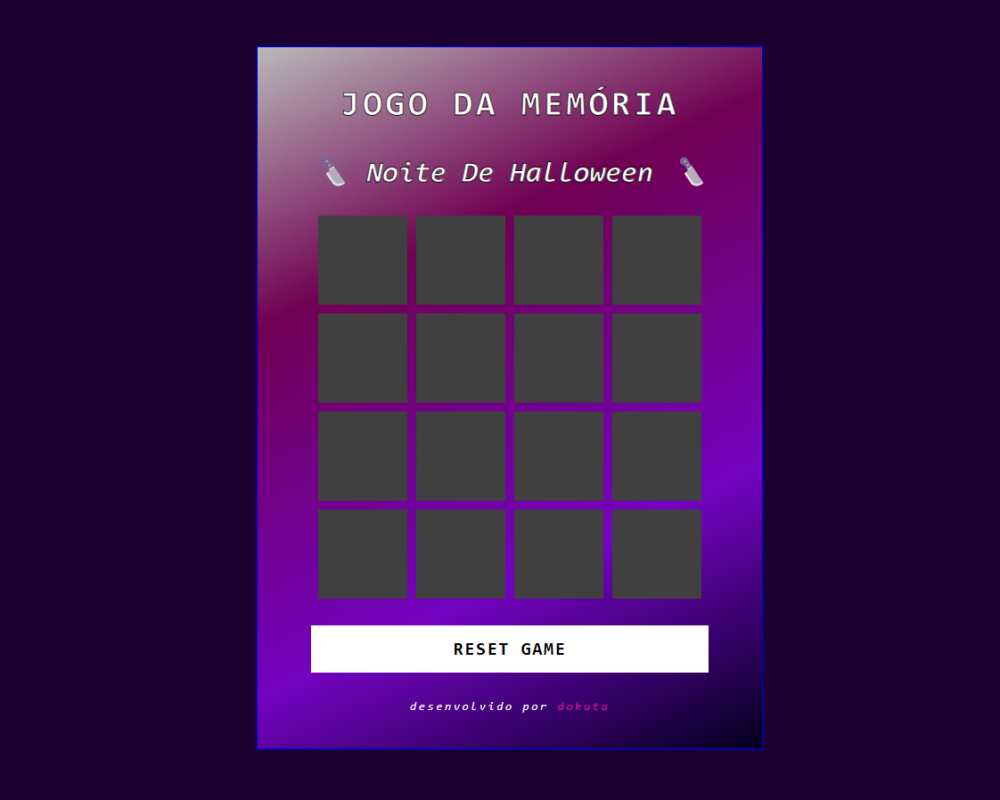

# Jogo da Memória: Noite de Halloween

Jogo da memória simples, com temática de Dia das Bruxas. Baseado no Desafio de Projeto da plataforma DIO.

## Tecnologias Utilizadas

- HTML
- CSS
- Javascript
- Manipulação do DOM

## Screenshots

## Demonstração

Você pode jogar clicando [aqui](https://memory-game-lemon-one.vercel.app/).

## Aprendizados

O Javascript é uma ferramenta poderosa, e aprendi que sua capacidade de interagir com os elementos da tela abrem muitas possibilidades.